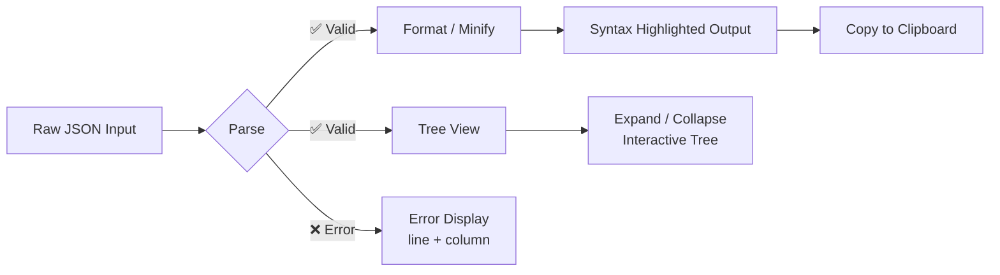

# {JSON} Pretty


<p align="center">
  
</p>

A **polished, single-file** JSON formatter, validator, and tree-view explorer — all in one HTML page. No build step, no dependencies, deploy anywhere.

**[→ Live Demo](https://your-username.github.io/json-pretty)** (replace with your GitHub Pages URL)

---

## ✨ Features

- **Format** — Pretty-prints JSON with full syntax highlighting (keys, strings, numbers, booleans, null)
- **Minify** — Compresses JSON to a single line
- **Validate** — Validates JSON syntax with detailed error messages including line & column numbers
- **Tree View** — Interactive expandable/collapsible JSON tree with clickable keys
- **Drag & Drop** — Drop `.json` files directly onto the page
- **Copy** — One-click copy of formatted output to clipboard
- **Stats** — Real-time character and line counts
- **Dark Theme** — Eye-friendly dark UI with orange accent
- **Responsive** — Works on desktop and mobile
- **Zero Dependencies** — Everything in one HTML file, no CDN, no build tools

## 🚀 Usage

Open `index.html` in any modern browser, or deploy to GitHub Pages / Netlify / any static host.

1. Paste JSON into the input textarea (or drag-and-drop a `.json` file)
2. Click **Format**, **Minify**, **Validate**, or **Tree**
3. Use **Copy** to grab the formatted output

Keyboard shortcut: <kbd>Ctrl+Enter</kbd> / <kbd>Cmd+Enter</kbd> to format.

## 🔧 Pipeline



## 📁 Files

```
json-pretty/
├── index.html          # Single-file application (~29 KB)
└── README.md           # This file
```

## 🎨 Syntax Highlighting

| Token    | Color    | Example            |
|----------|----------|--------------------|
| Keys     | Orange   | `"name"`           |
| Strings  | Blue     | `"hello"`          |
| Numbers  | Cyan     | `42`, `3.14`       |
| Booleans | Purple   | `true`, `false`    |
| Null     | Purple   | `null`             |

## 📄 License

MIT — see [LICENSE](LICENSE) or the license header below.

```
MIT License

Copyright (c) 2026

Permission is hereby granted, free of charge, to any person obtaining a copy
of this software and associated documentation files (the "Software"), to deal
in the Software without restriction, including without limitation the rights
to use, copy, modify, merge, publish, distribute, sublicense, and/or sell
copies of the Software, and to permit persons to whom the Software is
furnished to do so, subject to the following conditions:

The above copyright notice and this permission notice shall be included in all
copies or substantial portions of the Software.

THE SOFTWARE IS PROVIDED "AS IS", WITHOUT WARRANTY OF ANY KIND, EXPRESS OR
IMPLIED, INCLUDING BUT NOT LIMITED TO THE WARRANTIES OF MERCHANTABILITY,
FITNESS FOR A PARTICULAR PURPOSE AND NONINFRINGEMENT. IN NO EVENT SHALL THE
AUTHORS OR COPYRIGHT HOLDERS BE LIABLE FOR ANY CLAIM, DAMAGES OR OTHER
LIABILITY, WHETHER IN AN ACTION OF CONTRACT, TORT OR OTHERWISE, ARISING FROM,
OUT OF OR IN CONNECTION WITH THE SOFTWARE OR THE USE OR OTHER DEALINGS IN THE
SOFTWARE.
```
