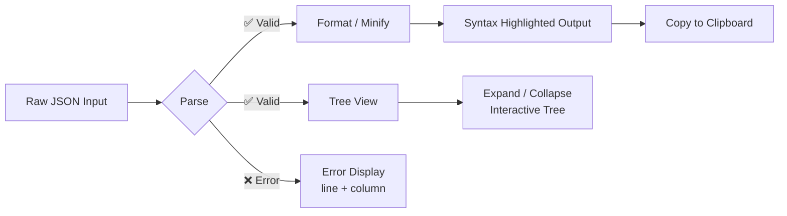

<div align="center">

  <picture>
    <source media="(prefers-color-scheme: dark)" srcset="data:image/svg+xml,%3Csvg%20xmlns%3D%27http%3A//www.w3.org/2000/svg%27%20viewBox%3D%270%200%2064%2064%27%3E%0A%20%20%3Crect%20width%3D%2764%27%20height%3D%2764%27%20fill%3D%27%231a1a2e%27%20rx%3D%2712%27/%3E%0A%20%20%3Cpath%20d%3D%27M20%2010%20C12%2010%2010%2015%2010%2022%20C10%2027%2014%2029%2014%2032%20C14%2035%2010%2037%2010%2042%20C10%2049%2012%2054%2020%2054%27%20fill%3D%27none%27%20stroke%3D%27%23ff6b35%27%20stroke-width%3D%273.5%27%20stroke-linecap%3D%27round%27%20stroke-linejoin%3D%27round%27/%3E%0A%20%20%3Cpath%20d%3D%27M44%2010%20C52%2010%2054%2015%2054%2022%20C54%2027%2050%2029%2050%2032%20C50%2035%2054%2037%2054%2042%20C54%2049%2052%2054%2044%2054%27%20fill%3D%27none%27%20stroke%3D%27%23ff6b35%27%20stroke-width%3D%273.5%27%20stroke-linecap%3D%27round%27%20stroke-linejoin%3D%27round%27/%3E%0A%20%20%3Cline%20x1%3D%2727%27%20y1%3D%2720%27%20x2%3D%2727%27%20y2%3D%2744%27%20stroke%3D%27%23d2a8ff%27%20stroke-width%3D%272.5%27%20stroke-linecap%3D%27round%27/%3E%0A%20%20%3Cline%20x1%3D%2727%27%20y1%3D%2720%27%20x2%3D%2731%27%20y2%3D%2720%27%20stroke%3D%27%23d2a8ff%27%20stroke-width%3D%272.5%27%20stroke-linecap%3D%27round%27/%3E%0A%20%20%3Cline%20x1%3D%2727%27%20y1%3D%2744%27%20x2%3D%2731%27%20y2%3D%2744%27%20stroke%3D%27%23d2a8ff%27%20stroke-width%3D%272.5%27%20stroke-linecap%3D%27round%27/%3E%0A%20%20%3Cline%20x1%3D%2737%27%20y1%3D%2720%27%20x2%3D%2737%27%20y2%3D%2744%27%20stroke%3D%27%23d2a8ff%27%20stroke-width%3D%272.5%27%20stroke-linecap%3D%27round%27/%3E%0A%20%20%3Cline%20x1%3D%2733%27%20y1%3D%2720%27%20x2%3D%2737%27%20y2%3D%2720%27%20stroke%3D%27%23d2a8ff%27%20stroke-width%3D%272.5%27%20stroke-linecap%3D%27round%27/%3E%0A%20%20%3Cline%20x1%3D%2733%27%20y1%3D%2744%27%20x2%3D%2737%27%20y2%3D%2744%27%20stroke%3D%27%23d2a8ff%27%20stroke-width%3D%272.5%27%20stroke-linecap%3D%27round%27/%3E%0A%20%20%3Cline%20x1%3D%2728%27%20y1%3D%2728%27%20x2%3D%2736%27%20y2%3D%2728%27%20stroke%3D%27%233fb950%27%20stroke-width%3D%271.8%27%20stroke-linecap%3D%27round%27/%3E%0A%20%20%3Cline%20x1%3D%2728%27%20y1%3D%2736%27%20x2%3D%2732%27%20y2%3D%2736%27%20stroke%3D%27%233fb950%27%20stroke-width%3D%271.8%27%20stroke-linecap%3D%27round%27/%3E%0A%20%20%3Ccircle%20cx%3D%2733%27%20cy%3D%2736%27%20r%3D%271.2%27%20fill%3D%27%233fb950%27/%3E%0A%3C/svg%3E">
    
  </picture>

  <h1>{JSON} Pretty</h1>

  <p>A <strong>polished, single-file</strong> JSON formatter, validator, and tree-view explorer — all in one HTML page. No build step, no dependencies, deploy anywhere.</p>

  <p>
    <a href="https://soumendrak.github.io/json-pretty"><strong>🌐 Live Demo</strong></a>
    ·
    <a href="#features"><strong>Features</strong></a>
    ·
    <a href="#usage"><strong>Usage</strong></a>
    ·
    <a href="#license"><strong>License</strong></a>
  </p>

  <p>
    
    
    
    
    
  </p>

</div>

---

## ✨ Features

- **Format** — Pretty-prints JSON with full syntax highlighting (keys, strings, numbers, booleans, null)
- **Minify** — Compresses JSON to a single line
- **Validate** — Validates JSON syntax with detailed error messages including line & column numbers
- **Tree View** — Interactive expandable/collapsible JSON tree with clickable keys
- **Drag & Drop** — Drop `.json` files directly onto the page
- **Copy** — One-click copy of formatted output to clipboard
- **Stats** — Real-time character and line counts
- **Dark Theme** — Eye-friendly dark UI with orange accent
- **Responsive** — Works on desktop and mobile
- **Zero Dependencies** — Everything in one HTML file, no CDN, no build tools

## 🚀 Usage

Open `index.html` in any modern browser, or deploy to GitHub Pages / Netlify / any static host.

1. Paste JSON into the input textarea (or drag-and-drop a `.json` file)
2. Click **Format**, **Minify**, **Validate**, or **Tree**
3. Use **Copy** to grab the formatted output

Keyboard shortcut: <kbd>Ctrl+Enter</kbd> / <kbd>Cmd+Enter</kbd> to format.

## 🔧 Pipeline



## 📁 Files

```
json-pretty/
├── index.html          # Single-file application (~29 KB)
└── README.md           # This file
```

## 🎨 Syntax Highlighting

| Token    | Color    | Example            |
|----------|----------|--------------------|
| Keys     | Orange   | `"name"`           |
| Strings  | Blue     | `"hello"`          |
| Numbers  | Cyan     | `42`, `3.14`       |
| Booleans | Purple   | `true`, `false`    |
| Null     | Purple   | `null`             |

## 📄 License

Licensed under the [MIT License](LICENSE).
